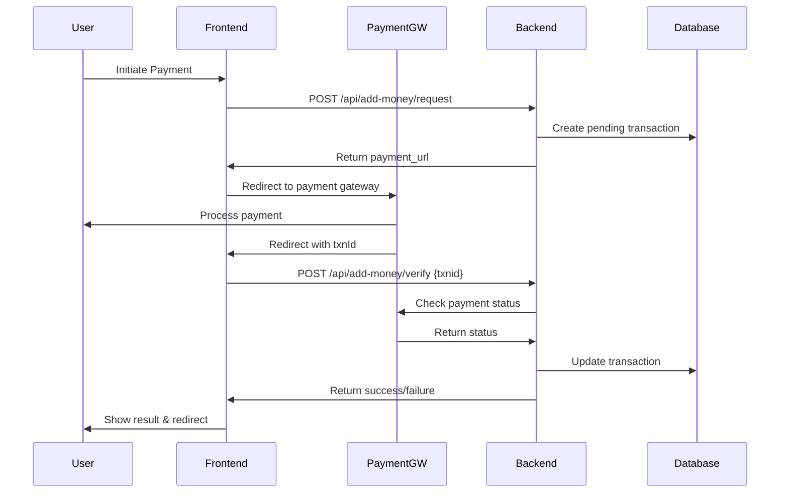

# Payment Verification Flow - Quick Reference

## 🔄 Complete Payment Flow



## 📥 URL Parameters Extraction

### Incoming URL Format
```
url('')./addFundReceipt?amount=1000&txnId=ENX1729123456
```

### React Code
```jsx
const [searchParams] = useSearchParams();
const txnId = searchParams.get('txnId');        // "ENX1729123456"
const amount = searchParams.get('amount');       // "1000"
```

## 📤 API Request

### POST Request to Backend
```javascript
const apiService = ApiService();
const response = await apiService.vPost(
    '/api/add-money/verify',
    { txnid: txnId },  // ← Key is 'txnid' (not 'txnId')
    true,
    true
);
```

### Backend Route
```php
Route::post('/add-money/verify', [AccountController::class, 'addFundReceipt']);
```

### Controller Method
```php
public function addFundReceipt(Request $request) {
    $txnId = $request->txnid;  // ← Receives 'txnid'
    
    // Verify transaction exists
    $addMoney = DB::table('accounts_add_money')
        ->where('txnid', $txnId)
        ->where('status', 'pending')
        ->first();
    
    // Check payment gateway status
    // Update database
    // Return response
}
```

## 📊 Response Handling

### Success Response
```json
{
    "status": 1,
    "message": "Payment successful.",
    "data": {
        "utr": "123456789012"
    }
}
```

### Frontend Handling
```javascript
if (data.status === 1) {
    toast.success('Payment Successful.');
    navigate('/banking/add-fund-history');  // Redirect to history
}
```

### Failure Response
```json
{
    "status": 0,
    "message": "Payment failed."
}
```

### Frontend Handling
```javascript
if (data.status !== 1) {
    toast.error(data.message);
    navigate('/banking/add-fund-request');  // Redirect back to request
}
```

## 🎨 UI States

### State 1: Verification Screen (with txnId)
```jsx
if (isVerificationPage) {
    return (
        <div className="spinner-border">Loading...</div>
        <h4>Verifying Payment...</h4>
        <p>Transaction ID: {txnId}</p>
    );
}
```

### State 2: Add Fund Form (no txnId)
```jsx
return (
    <form onSubmit={handleSubmit}>
        <select name="account_id">...</select>
        <input name="amount" />
        <button type="submit">Submit Request</button>
    </form>
);
```

## 🔍 Key Points

### 1. Parameter Name Consistency
```javascript
// URL parameter: txnId (camelCase)
searchParams.get('txnId')

// API payload key: txnid (lowercase)
{ txnid: txnId }

// Backend receives: txnid (lowercase)
$request->txnid
```

### 2. Automatic Verification
```javascript
useEffect(() => {
    const txnId = searchParams.get('txnId');
    
    if (txnId) {
        // Automatically verify when txnId present
        verifyPayment();
    }
}, [searchParams, navigate]);
```

### 3. Redirect Timing
```javascript
// Add 2-second delay before redirect
setTimeout(() => {
    navigate('/banking/add-fund-history');
}, 2000);
```

## 🧪 Testing URLs

### Test Successful Payment
```
http://localhost/addFundReceipt?amount=1000&txnId=ENX1729123456
```

### Test Failed Payment
```
http://localhost/addFundReceipt?amount=1000&txnId=INVALID_TXN
```

### Test Normal Add Fund Page
```
http://localhost/addFundReceipt
```

## 🐛 Debugging

### Check URL Parameters
```javascript
console.log('Transaction ID:', searchParams.get('txnId'));
console.log('Amount:', searchParams.get('amount'));
```

### Check API Request
```javascript
console.log('Posting to API with:', { txnid: txnId });
```

### Check API Response
```javascript
console.log('API Response:', response.data);
```

### Check Navigation
```javascript
console.log('Navigating to:', '/banking/add-fund-history');
```

## ✅ Checklist

- [ ] URL parameters extracted correctly
- [ ] API endpoint receives correct data
- [ ] Loading state shows during verification
- [ ] Success toast appears on success
- [ ] Error toast appears on failure
- [ ] Redirects to history on success
- [ ] Redirects to request page on failure
- [ ] No console errors
- [ ] Mobile responsive
- [ ] Toast notifications visible

## 📞 Support

If verification fails:
1. Check browser console for errors
2. Verify API endpoint is accessible
3. Check database for transaction status
4. Verify payment gateway callback is configured
5. Check network tab for API request/response

## 🎯 Success Criteria

✅ **Working Implementation:**
- User completes payment on gateway
- Returns to receipt page with txnId
- Verification happens automatically
- Success message displays
- Redirects to fund history
- Transaction appears in database
- Balance updates correctly

---

**Last Updated:** October 19, 2025
**Version:** 1.0
**Status:** ✅ Production Ready
